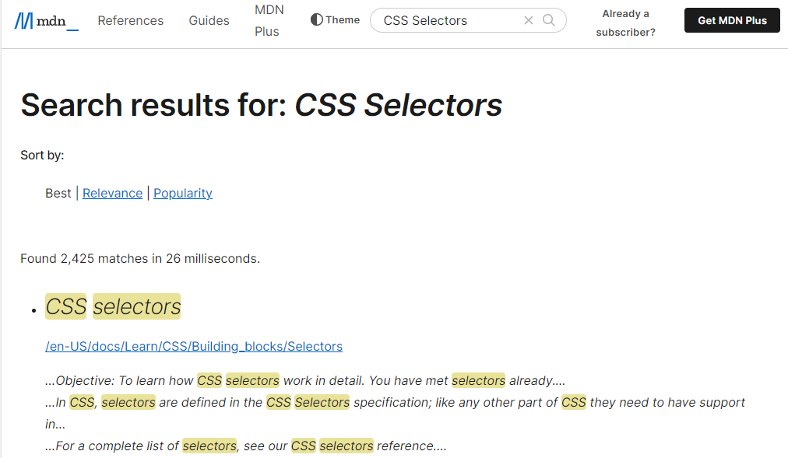
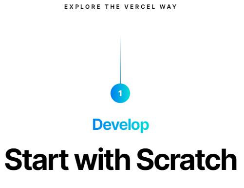

# Dom Manipulation Assignment

1. Website Name: [Dev To](https://dev.to/)

### Topics

    - Query Selector, Inner HTML

### Sample Image

### Tasks

        Target the Top description div and change the DEV Community to <Your_Name> and description to your passion

### Output

     document.querySelector(".side-bar .crayons-card .crayons-subtitle-2").innerHTML = "iNeuron"

     document.querySelector(".side-bar .crayons-card .color-base-70").innerHTML = "I Write Code"    

2. Website Name: [Apple](https://support.apple.com/en-in)

### Task

### Fetch all the product name and store in an array

### Output

     let productName = [];
     document.querySelectorAll(".as-imagegrid-item").forEach((e) => { productName.push(e.innerText.replace("\nSupport"," "))
     })
     console.log(productName);

     ['iPhone ', 'Mac ', 'iPad ', 'Watch ', 'AirPods ', 'Music ', 'TV ']

['iPhone', 'Mac', 'iPad', 'Watch', 'AirPods', 'Music', 'TV']

3. Webiste Name: [Youtube Support](https://support.google.com/youtube/)

### Topics

    - Get Element By Id, Create Element, Create Text Node, Append Child

### Sample Image

### Tasks

     Add another FAQ 'My New FAQ' to the list

### Output

     let element = document.getElementById("hcfe-content")
     let items = document.querySelector(".primary-container .page-width-container .main-content .article .accordion-homepage")

     let new_elem = document.createElement("section")
     new_elem.className = "parent";
     let text = new_elem.innerHTML = "<h3> My New FAQ </h3>"

     items.append(new_elem)

4. Webiste Name: [OnePlus](https://www.oneplus.in/support)

### Topics

     Query Selector, InnerText

### Sample Image

### Tasks

      Change the contact number

### Output

     let number = document.querySelector(".customer-support .one-tel-number")
     let new_number = number.innerText = "+ 91 6366256689"

5. Webiste Name: [Samsung](https://www.samsung.com/in/offer/online/samsung-fest/)

### Topics

       getElementById, createElement, InnerText, append, setAttribute

### Sample Image

### Tasks

     Target the main div of card and change the Button text to Check out

### Output

     CANNOT FIND THE GIVEN IMAGE IN THE WEBSITE LINK PROVIDED

6. Webiste Name: [Adidas](https://www.adidas.co.in/)

### Topics

    -   Query Selector, Event listeners, Changing Styles

### Sample Image

### Tasks

     Target the search box and on hover change thebackground color to red.

### Output

     let icon = document.querySelector(".searchinput___19uW0");

     icon.addEventListener("mouseover", function mouseOver(e) {
     e.target.style.backgroundColor = 'red';
     });

     icon.addEventListener("mouseout", function mouseOut(a) {
     a.target.style.backgroundColor = '#edeff1';
     });

7. Webiste Name: [MDN Web Docs](https://developer.mozilla.org/en-US/)

### Topics

       Form, Value, Submit

### Sample Image

### Tasks

     To Search a topic in the MDN Search bar.
     First add a text to search in the search bar and then hit the submit search button to search the docs using DOM

### Output

          function search(text) {
          let check = document.querySelector("search-input-field");
          check.value = text;
          let form = document.getElementById("top-nav-search-form");
          form.submit();
          }
     search("CSS Selector")

8. Webiste Name: [Google](https://www.google.com/)

### Topics

       Remove Elements

### Sample Image

### Tasks

     Remove alternate languages from the home page languages listed

### Output

          let ele = document.querySelector("");
          for (let i = 0; i < ele.length; i++) {
          if (i % 2 == 0) {
          ele[i].remove();
          }
     }
     console.log(ele);

9. Webiste Name: [Code Wars](https://www.codewars.com/)

### Topics

       Change Font Family, Color of Text.

### Sample Image

### Tasks

    Change the font family of the text to monospace and text color to the logo’s background color.

### Output

     let text = document.querySelector(".display-heading-1");
     text.style.color = "red"
     text.style.fontFamily = "monospace"

10. Webiste Name: [Freecodecamp](https://www.freecodecamp.org/)

### Topics

       querySelector, mouseover, click eventListener,  callback function, style,

### Sample Image

### Tasks

    Target the button and change background colour on mouseover

### Output

     let button = document.querySelector(".btn-cta-big");
     button. addEventListener("mouseover", function mouseOver(e) {e.target.style.backgroundColor = "red"
     });
     button. addEventListener("mouseout", function mouseOut(e) {
     e.target.style.backgroundColor = "#fecc4c "});

11. Webiste Name: [realme](https://www.realme.com/in/)

### Topics

       querySelector,style,background-image

### Sample Image

### Tasks

    change the realme logo to ineuron logo

### Output

     let pic = document.querySelector(".logo .icon")
     pic.style.backgroundImage = "url('https://ineuron.ai/images/ineuron-logo.png')"

12. Webiste Name: [Github](https://github.com/)

### Topics

       querySelector,style,background-Color

### Sample Image

### Tasks

     change the background colour of the button to blue.

### Output

     let image = document.querySelector(".mb-2");
     image.style.backgroundColor="blue"
     console.log(image)

13. Webiste Name: [Hackerrank](https://www.hackerrank.com/)

### Topics

       querySelector,innerHtml

### Sample Image

### Tasks

Target the top description and change “Matching developers with great companies” to ‘JSBOOTCAMP“.

### Output

     document.querySelector(".fl-heading-text").innerText = "JSBOOTCAMP"

14. Webiste Name: [Asus](https://www.asus.com/in/)

### Topics

      querySelector,style,font-size

### Sample Image

### Tasks

       change the fontsize of “Hot Deals” to 80px

### Output

     document.querySelector(".HotDealsAll__Heading__2fIbe").style.fontSize = "80px"

15. Webiste Name: [Dell](https://www.dell.com/en-in/shop/deals/laptop-deals?gacd=10415953-9016-5761040-285981356-0&dgc=ST&gclid=Cj0KCQjwguGYBhDRARIsAHgRm4-XUDMhhVNyHXb3s1gY4ZBzORr_d9Se-buhJwy7asyUe7YdqEA11eEaAt6UEALw_wcB&gclsrc=aw.ds&nclid=BxjBlpBQsX6pjSHh-L8YYSU77EpfXRkG1AGMB5Wbeu386ykspfrPDnfx_DdFau20)

### Topics

      querySelector,style.textAlign

### Sample Image

### Tasks

       Convert the text “G15 Gaming Laptop” from left to right

### Output

     let text = document.querySelector("#d560822win9b .ps-top .ps-title").style.textAlign = "right";
     console.log(text);

16. Webiste Name: [Vercel](https://vercel.com/)

### Topics

     querySelector,innerHTMl

### Sample Image

### Tasks

      change the heading “Start with the developer” to “Start with Scratch”

### Output

     document.querySelector(".section-title_title__VEDfK").innerText = "Start with Scratch"

17. Webiste Name: [Sony](https://www.sony.co.in/)

### Topics

    querySelector,innerHTMl

### Sample Image

### Tasks

     change the button text To current Date.

### Output

     document.querySelector(".WhatsHotItem__PriceContainer").innerText = new Date();

18. Webiste Name: [Philips](https://www.philips.co.in/)

### Topics

     querySelector,style,backgroundcolor

### Sample Image

### Tasks

    change the background colour blue to orange

### Output

     document.querySelector(".p-f03-footer-container .p-footer ").style.backgroundColor = "orange"

19. Webiste Name: [Canon](https://in.canon/)

### Topics

          querySelector,src

### Sample Image

### Tasks

    extract the canon logo

### Output

20. Webiste Name: [Oppo](https://www.oppo.com/in/)

### Topics

          querySelector,style,color

### Sample Image

### Tasks

      Change the description colour black to orange

### Output

